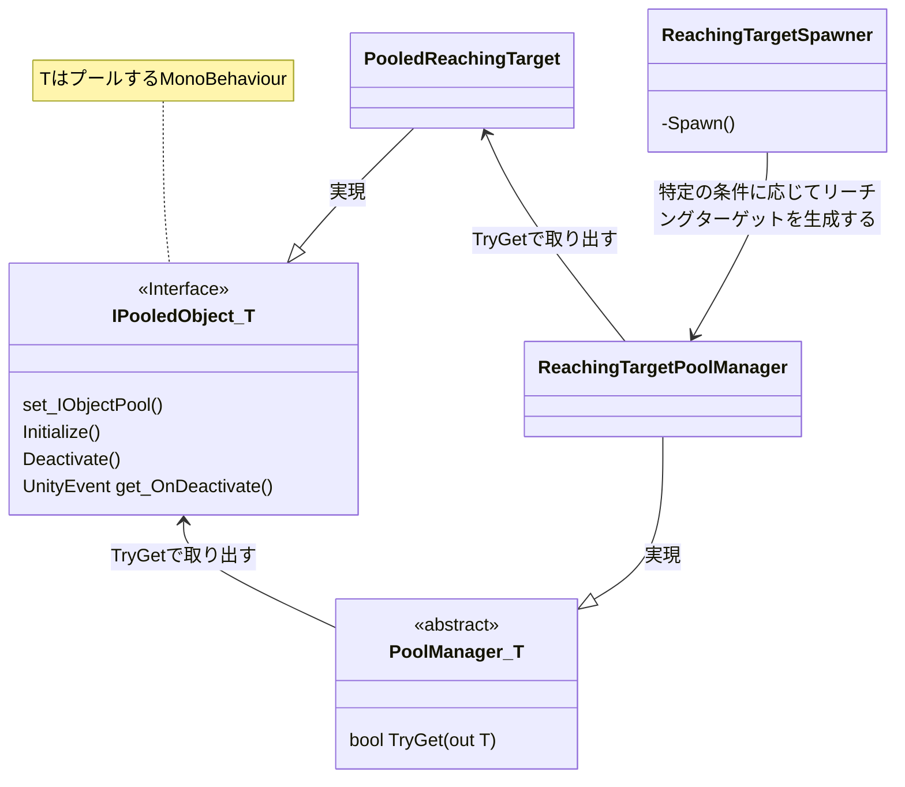

# GenericReachingTask
VRの実験で頻出のリーチング課題をサクサク実装できるパッケージです。
単純なリーチング課題から融合身体でおなじみのN芒星デュアルタスクまで対応しています。
誰でも使えますが、（実装が面倒くさくて）あらゆるサンプルを用意したわけではないので、適宜カスタムして使ってください。

## Architecture
ObjectPoolデザインパターンでリーチングターゲットを管理します。
ObjectPoolの実装は以下を参考にしました。ありがとうございます。

https://qiita.com/KeichiMizutani/items/ca46a40de02e87b3d8a8

リーチングターゲットはシーンごとに固有の `ReachingTargetSpawner` によって生成します。
使い方はサンプルシーンを再生したり、それぞれのサンプルシーンの `ReachingTargetSpawner` のコードを覗いてみるとだいたいわかると思います。



### リーチングターゲット（ `IPooledObject` を継承）
サンプルとして用意しているのは以下の3種類です。
それぞれ `IPooledObject` を継承していますが、他の継承関係は特にありません。
消滅時にコールバック `OnDeactivated` が呼ばれるので、リーチング課題の成績を測定する場合は生成時に以下のようにコールバックを登録してください。

```C#
// 生成に成功したらif文の中に入る
if (m_poolManager.TryGet(out var target) && target != null)
{
    // 適当に位置を変更する
    target.transform.position = RANDOM_POSITION;
    // コールバックを登録する
    target.OnDeactivated.AddListener(() =>
    {
        Debug.Log("Reached!");
        SCORE++;
    });
}
```

- `PooledReachingTarget`<br>
ごく一般的なリーチングターゲットです。
生成された後何らかの `Collider` にぶつかると消滅します。

- `PooledReacingTargetMortal`<br>
生成後一定時間が経過すると自動で消滅するリーチングターゲットです。
その他の性質は `PooledReachingTarget` と同じです。

- `PooledMultipleReachingTarget`<br>
デュアルタスク用のリーチングターゲットです。
`Collider` に触れている間、その `Collider` を記憶しておきます（自動消滅はしません）。
記憶している `Collider` が0個でない場合、常にプロパティ `PooledMultipleReachingTarget.IsReached` が `true` になります。
生成した側が `Update()` 等でこの値を監視しておき、すべてのリーチングターゲットで `IsReached = true` を返した時に全てを消滅させるようスクリプトを組んでください。
詳細はデュアルタスクのサンプルシーンとサンプルコードをお読みください。

### リーチングターゲットの `PoolManager`
それぞれのリーチングターゲットに対して `PoolManager` を継承したプールコンポーネントがあります。
`PoolManager.TryGet(out T target)` で新しいリーチングターゲットを取得できます。

### リーチングターゲットの生成器（ `Spawner` ）
リーチングタスクに固有な生成用コンポーネントを作ってリーチングターゲットを生成しましょう。

## Appendix
N芒星タスクのために、子オブジェクトを正N角形状に自動で並べるコンポーネント `NGonAligner` を用意しておきました。
