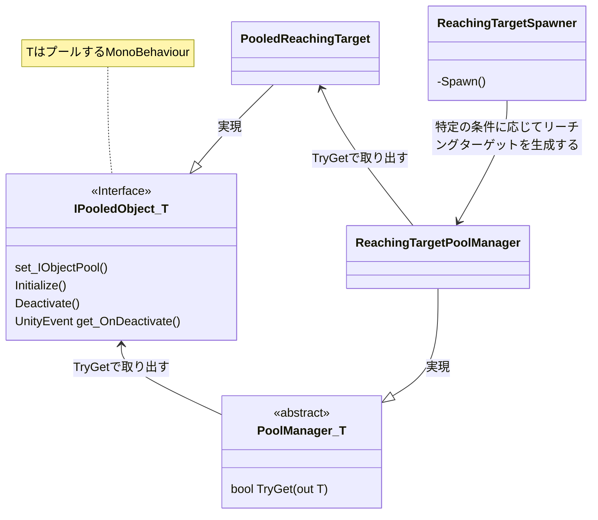

# GenericReachingTask
VRの実験で頻出のリーチング課題をサクサク実装できるパッケージです。
単純なリーチング課題から融合身体でおなじみのN芒星デュアルタスクまで対応しています。
誰でも使えます。

## Architecture
ObjectPoolデザインパターンでリーチングターゲットを管理します。
ObjectPoolの実装は以下を参考にしました。ありがとうございます。

https://qiita.com/KeichiMizutani/items/ca46a40de02e87b3d8a8

リーチングターゲットはシーンごとに固有の `ReachingTargetSpawner` によって生成します。
使い方はサンプルシーンを再生したり、それぞれのサンプルシーンの `ReachingTargetSpawner` のコードを覗いてみるとだいたいわかると思います。

## Appendix
N芒星タスクのために、子オブジェクトを正N角形状に自動で並べるコンポーネント `NGonAligner` を用意しておきました。
